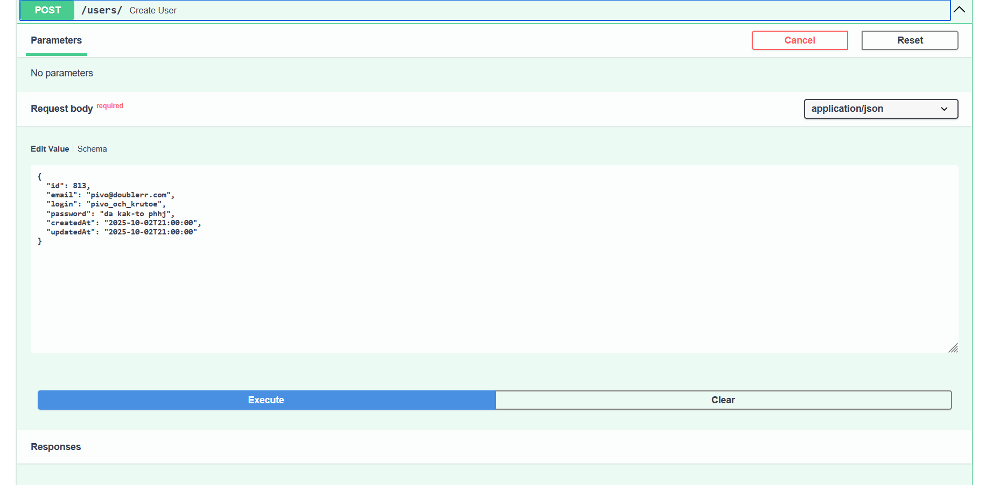
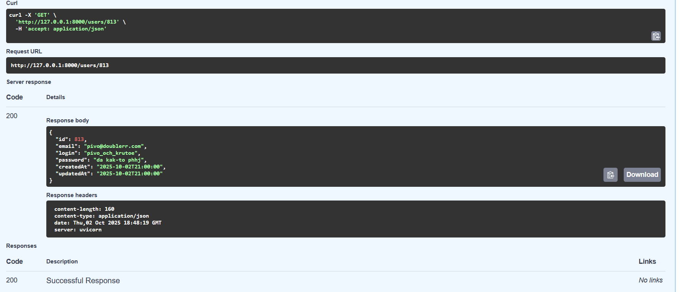
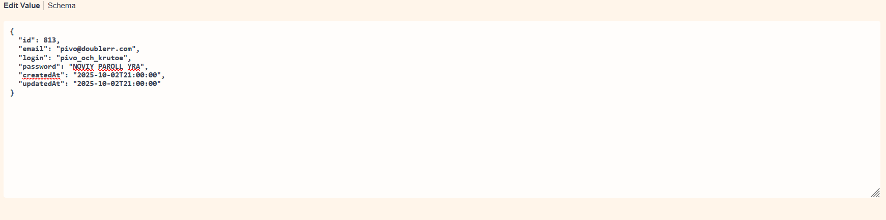
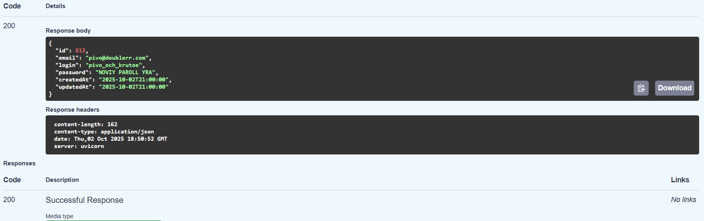
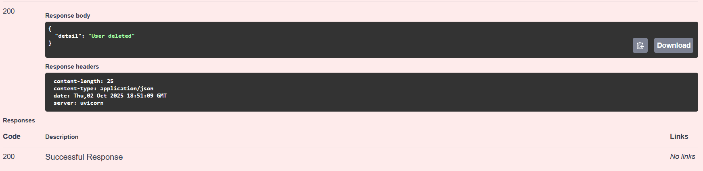
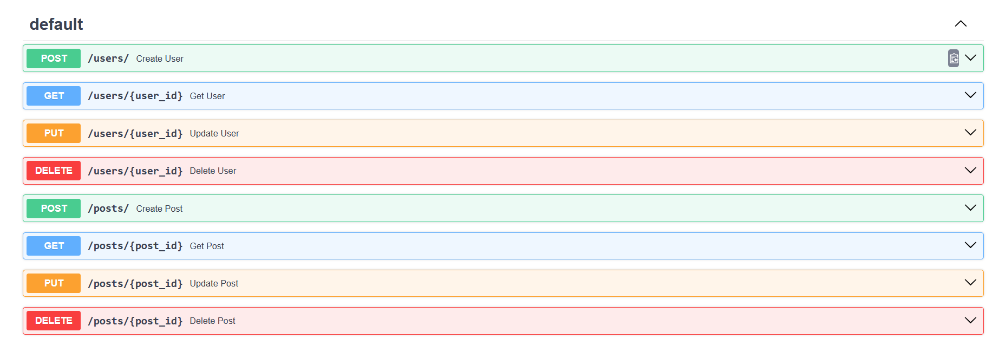
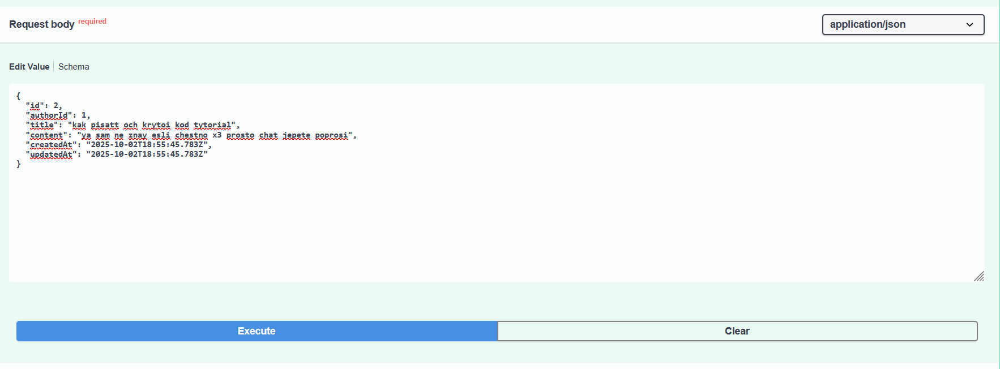
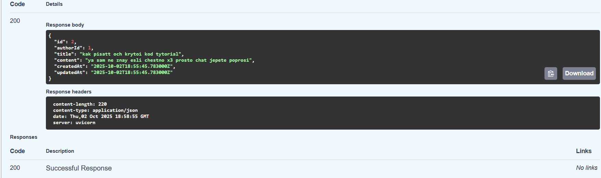
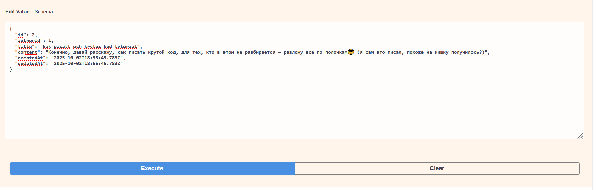
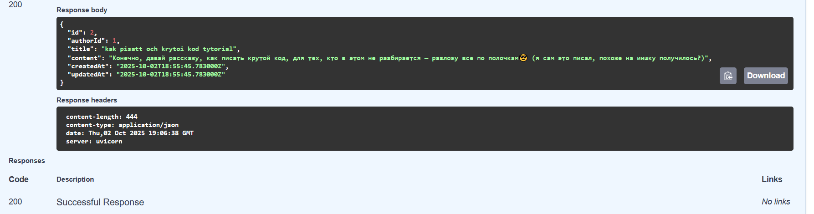

# Блог на FastAPI

Что сделано

- Регистрация и вход (авторизация через сессии).
- Главная страница с лентой постов.
- Страница создания поста.
- Страница профиля пользователя.
- Валидация форм (обязательные поля).
- Обработка ошибок (400, 401, 409).

Как запустить (в powershell, например)

1. Установить зависимости:
pip install fastapi uvicorn jinja2 python-multipart sqlalchemy

2. Запустить сервер:
uvicorn main:app --reload

3. Открыть в браузере: 
http://127.0.0.1:8000

Скриншоты (еще из старой версии, уже не актуальные):

###поставьте троечку пожалуйста